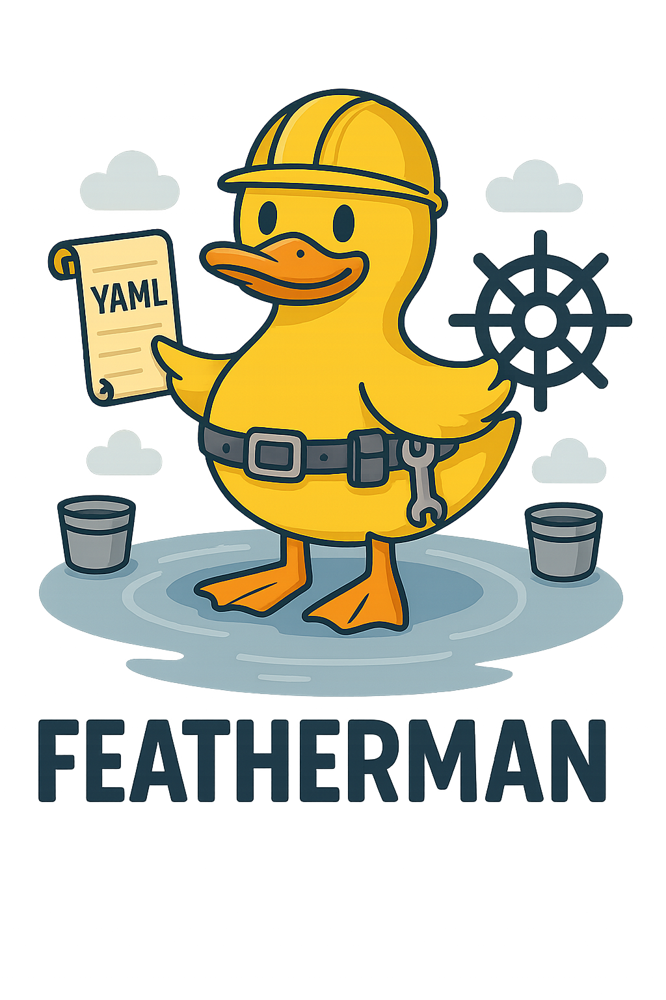
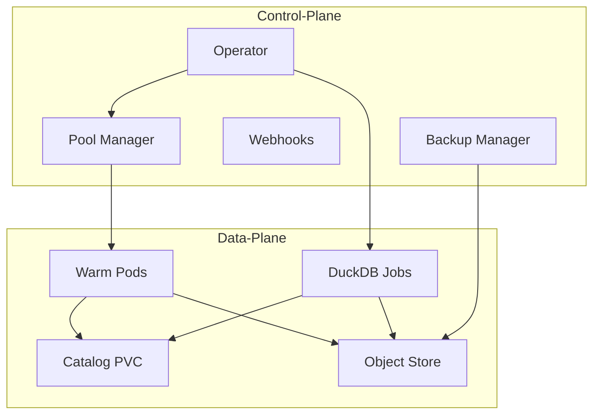

<div align="center"></div>

Featherman brings DuckDB's powerful DuckLake functionality to Kubernetes, enabling declarative management of data lakes with the simplicity of DuckDB and the scalability of cloud object storage.

> This project is in early development. Any contributions are appreciated.

## Features

- 🦆 **DuckDB-Native**: Leverages DuckDB's simplicity and performance
- 🎯 **Declarative**: Define your data lake structure using Kubernetes CRDs
- ☁️ **Cloud Storage**: Seamless integration with S3-compatible object stores
- 🔒 **Enterprise Ready**: Built-in backup, encryption, and monitoring
- 🚀 **Kubernetes-Native**: Fully integrated with K8s ecosystem
- ⚡ **Warm Pod Pool**: Pre-initialized DuckDB pods for low-latency queries

## Development Setup

1. Prerequisites:
   - Go 1.21+
   - Docker
   - KinD (Kubernetes in Docker)
   - kubectl

2. Set up local development cluster:

```bash
make kind-setup
```

3. Deploy MinIO (for local S3-compatible storage):

```bash
make minio-setup
```

4. Build and load the operator:

```bash
make docker-build
make kind-load
make deploy
```

## Quick Start

1. Install Featherman:

```bash
# Clone the repository
git clone https://github.com/TFMV/featherman.git
cd featherman/operator

# Install CRDs
make install

# Deploy the operator
make deploy
```

2. Create a catalog:

```yaml
apiVersion: ducklake.featherman.dev/v1alpha1
kind: DuckLakeCatalog
metadata:
  name: example
spec:
  storageClass: standard
  size: 10Gi
  objectStore:
    endpoint: s3.amazonaws.com
    bucket: my-data-lake
    credentialsSecret:
      name: s3-credentials
  backupPolicy:
    schedule: "0 2 * * *"    # Daily at 2 AM
    retentionDays: 7
```

3. Create a table:

```yaml
apiVersion: ducklake.featherman.dev/v1alpha1
kind: DuckLakeTable
metadata:
  name: users
spec:
  catalogRef: example
  name: users
  columns:
    - name: id
      type: INTEGER
    - name: name
      type: VARCHAR
  format:
    compression: ZSTD
    partitioning: ["created_at"]
```

## Architecture

Featherman follows a cloud-native architecture designed for reliability and scalability:



### Components

- **Control Plane**
  - **Operator**: Manages CRDs and orchestrates data operations
  - **Backup Manager**: Handles scheduled backups and retention
  - **Webhooks**: Validates and defaults resource configurations
  - **Pool Manager**: Maintains warm pod pool for low-latency queries

- **Data Plane**
  - **DuckDB Jobs**: Ephemeral pods that execute SQL operations
  - **Warm Pods**: Pre-initialized pods for immediate query execution
  - **Catalog Storage**: Persistent volumes storing DuckDB metadata
  - **Object Store**: S3-compatible storage for Parquet data files

### Key Design Principles

1. **Separation of Concerns**: Metadata and data are stored separately for better scalability
2. **Stateless Operations**: All operations run in ephemeral jobs for reliability
3. **Cloud-Native Storage**: Leverages object storage for data and K8s volumes for metadata
4. **Kubernetes Patterns**: Follows standard K8s patterns like operator pattern and CRDs
5. **Performance Optimization**: Warm pod pool eliminates cold start latency

## Warm Pod Pool

The warm pod pool feature eliminates cold start latency by maintaining pre-initialized DuckDB pods ready to execute queries immediately. This is particularly useful for interactive workloads and low-latency query requirements.

### Configuration

```yaml
apiVersion: ducklake.featherman.dev/v1alpha1
kind: DuckLakePool
metadata:
  name: default-pool
spec:
  # Pool sizing
  minSize: 2
  maxSize: 10
  targetUtilization: 0.8
  
  # Pod template
  template:
    resources:
      requests:
        memory: "2Gi"
        cpu: "1"
      limits:
        memory: "4Gi"
        cpu: "2"
    
  # Lifecycle policies
  maxIdleTime: 300s          # Terminate pods idle > 5 min
  maxLifetime: 3600s         # Recycle pods after 1 hour
  maxQueries: 100            # Recycle after N queries
  
  # Scaling behavior
  scaleUpRate: 2             # Max pods to add per interval
  scaleDownRate: 1           # Max pods to remove per interval
  scaleInterval: 30s         # Evaluation interval
  
  # Catalog mounting
  catalogRef:
    name: main-catalog
    readOnly: true
```

### Benefits

1. **Performance**: Eliminates cold start latency (typically 5-10s → <100ms)
2. **Resource Efficiency**: Reuses initialized pods
3. **Predictable Latency**: Consistent query response times
4. **Graceful Degradation**: Falls back to Jobs if pool unavailable
5. **Cost Optimization**: Scales based on actual demand

### Metrics

The pool manager exposes Prometheus metrics for:

- `ducklake_pool_size_current`: Current number of pods
- `ducklake_pool_size_desired`: Target number of pods
- `ducklake_pool_pods_idle`: Number of idle pods
- `ducklake_pool_pods_busy`: Number of busy pods
- `ducklake_pool_queue_length`: Pending requests
- `ducklake_pool_query_duration`: Query execution time
- `ducklake_pool_wait_duration`: Time waiting for pod

## Testing

The operator includes comprehensive test suites:

1. **Unit Tests**: Test individual components and functions

```bash
make test
```

2. **End-to-End Tests**: Test full operator functionality in a KinD cluster

```bash
make e2e-test
```

The E2E tests require:

- Running KinD cluster
- MinIO deployment (for S3 testing)
- Controller image built and loaded
- Proper RBAC and namespace configuration

## Monitoring

The operator exposes Prometheus metrics for:

- Catalog operations (create, update, delete)
- Storage usage
- Backup status
- Job durations
- Error counts

Access metrics at `:8080/metrics` endpoint (configurable).

## License

MIT
