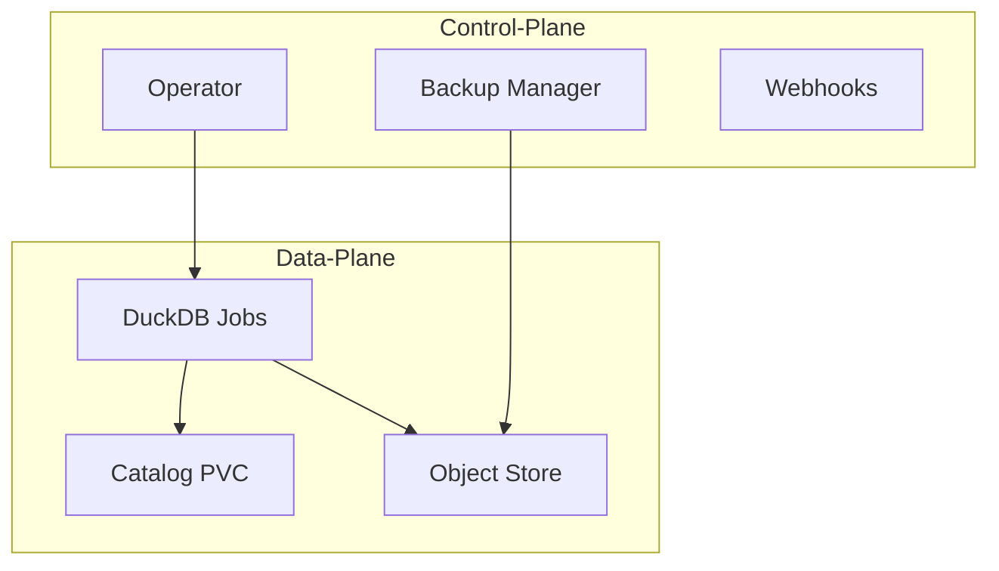

# Featherman

Featherman brings DuckDB's powerful DuckLake functionality to Kubernetes, enabling declarative management of data lakes with the simplicity of DuckDB and the scalability of cloud object storage.

## Features

- 🦆 **DuckDB-Native**: Leverages DuckDB's simplicity and performance
- 🎯 **Declarative**: Define your data lake structure using Kubernetes CRDs
- ☁️ **Cloud Storage**: Seamless integration with S3-compatible object stores
- 🔒 **Enterprise Ready**: Built-in backup, encryption, and monitoring
- 🚀 **Kubernetes-Native**: Fully integrated with K8s ecosystem

## Quick Start

1. Install Featherman:

```bash
kubectl apply -f https://raw.githubusercontent.com/TFMV/featherman/main/deploy/manifests.yaml
```

2. Create a catalog:

```yaml
apiVersion: ducklake.featherman.dev/v1alpha1
kind: DuckLakeCatalog
metadata:
  name: example
spec:
  storageClass: standard
  size: 10Gi
  objectStore:
    endpoint: s3.amazonaws.com
    bucket: my-data-lake
    region: us-west-2
  backupPolicy:
    schedule: "0 2 * * *"    # Daily at 2 AM
    retentionDays: 7
```

3. Create a table:

```yaml
apiVersion: ducklake.featherman.dev/v1alpha1
kind: DuckLakeTable
metadata:
  name: users
spec:
  catalogRef: example
  name: users
  columns:
    - name: id
      type: INTEGER
    - name: name
      type: VARCHAR
  format:
    compression: ZSTD
    partitioning: ["created_at"]
```

## Architecture

Featherman follows a cloud-native architecture designed for reliability and scalability:



### Components

- **Control Plane**
  - **Operator**: Manages CRDs and orchestrates data operations
  - **Backup Manager**: Handles scheduled backups and retention
  - **Webhooks**: Validates and defaults resource configurations

- **Data Plane**
  - **DuckDB Jobs**: Ephemeral pods that execute SQL operations
  - **Catalog Storage**: Persistent volumes storing DuckDB metadata
  - **Object Store**: S3-compatible storage for Parquet data files

### Key Design Principles

1. **Separation of Concerns**: Metadata and data are stored separately for better scalability
2. **Stateless Operations**: All operations run in ephemeral jobs for reliability
3. **Cloud-Native Storage**: Leverages object storage for data and K8s volumes for metadata
4. **Kubernetes Patterns**: Follows standard K8s patterns like operator pattern and CRDs

## License

MIT
