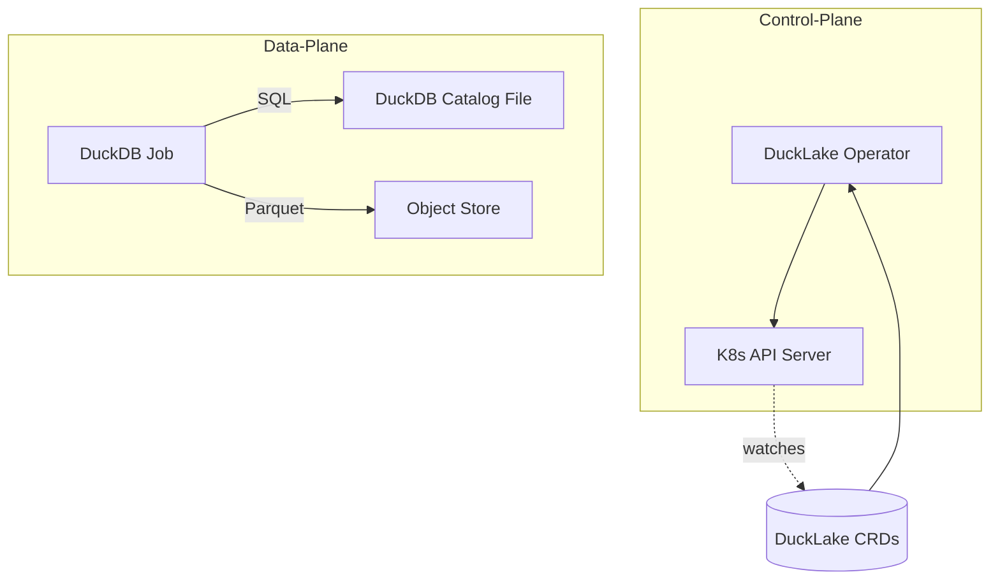

# Featherman Design

## 1. High-Level Architecture

Basic Flow:

1. User creates/updates a DuckLake Custom Resource
2. Operator reconciles by creating a DuckDB Job
3. Job executes SQL and manages Parquet files in object store
4. Status is updated with results

## 2. Custom Resources (MVP)

### DuckLakeCatalog

- Purpose: Defines the metadata storage configuration
- Spec:
  - `storageClass`: PVC storage class for catalog file
  - `objectStore`: S3-compatible store configuration
  - `size`: PVC size for catalog
  - `encryption`: Block encryption configuration (KMS key ID)
  - `backupPolicy`: Cron expression for backups
- Status:
  - `phase`: Current state (Pending/Running/Succeeded/Failed)
  - `lastBackup`: Timestamp of last successful backup

### DuckLakeTable

- Purpose: Declares table structure and location
- Spec:
  - `name`: Table name
  - `columns`: Column definitions
  - `format`: Parquet configuration
    - `compression`: ZSTD/SNAPPY
    - `partitioning`: List of partition columns
  - `location`: Object store path
  - `ttlDays`: Data retention period
  - `mode`: append/overwrite
- Status:
  - `phase`: Current state
  - `lastAppliedSnapshot`: Latest successful snapshot ID
  - `bytesWritten`: Total bytes written
  - `lastModified`: Last modification timestamp

## 3. Core Components

### 3.1 Operator

- Built with operator-sdk/Kubebuilder
- Single reconciler pattern
- Stateless design
- Handles CRD lifecycle
- Finalizers for clean resource deletion
- Validation webhooks for early error detection

### 3.2 Job Controller

- Creates ephemeral DuckDB pods
- Mounts catalog PVC
- Injects object store credentials
- Executes DDL/DML operations
- Features:
  - Init container with flock for DB file locking
  - Read-only PVC mounts for SELECT operations
  - Deterministic and idempotent SQL generation
  - Configurable via ConfigMap for pod templates
  - S3 consistency handling with HEAD checks

### 3.3 Storage

- Object Store: S3-compatible backend for Parquet files
- Catalog: DuckDB file on PVC for metadata
- Credentials managed via K8s secrets
- External secrets support (AWS Secrets Manager)

### 3.4 Observability

- Structured logging contract:
  - DEBUG: Full SQL scripts
  - INFO: Summarized operations (e.g., "Table X: +10 files, 23 MB")
- Grafana dashboard included in Helm chart
- Status metrics exposed for Prometheus

## 4. MVP Roadmap

### Phase 1: Foundation (2 weeks)

- [ ] Project setup with operator-sdk
- [ ] Basic CRD definitions with validation webhooks
- [ ] Simple reconciler loop
- [ ] DuckDB job template with init container
- [ ] Basic secret management

### Phase 2: Core Features (7 weeks)

- [ ] Table creation flow
- [ ] Parquet file management with consistency checks
- [ ] Read/Write job differentiation
- [ ] Error handling and retries
- [ ] Status updates and metrics
- [ ] Integration tests with mocked object store

### Phase 3: Stabilization (3 weeks)

- [ ] E2E testing on KinD
- [ ] Documentation
- [ ] Helm chart with Grafana dashboards
- [ ] Example manifests
- [ ] GitHub Actions CI/CD (K8s 1.29/1.30)
- [ ] kubectl plugin for table management

## 5. MVP Technical Decisions

1. **Catalog Storage**: Single DuckDB file on PVC
   - Simple, reliable for MVP
   - No concurrent write complexity
   - Init container with flock for safety
   - Read-only mounts for queries

2. **Job Model**: Ephemeral pods
   - Clean slate for each operation
   - Predictable resource usage
   - Idempotent operations
   - Configurable via ConfigMap

3. **Object Store**: S3-compatible only
   - Standardized interface
   - Wide compatibility
   - Consistency guarantees via HEAD checks
   - Atomic write operations

## 6. Future Considerations (Post-MVP)

- Warm pod pool for reduced latency
- Multi-writer support via Postgres catalog
- Interactive query gateway
- Snapshot/backup functionality
- Multi-tenancy
- Advanced monitoring
- Cost-based auto-vacuum/compact
- Policy-based schema drift detection
