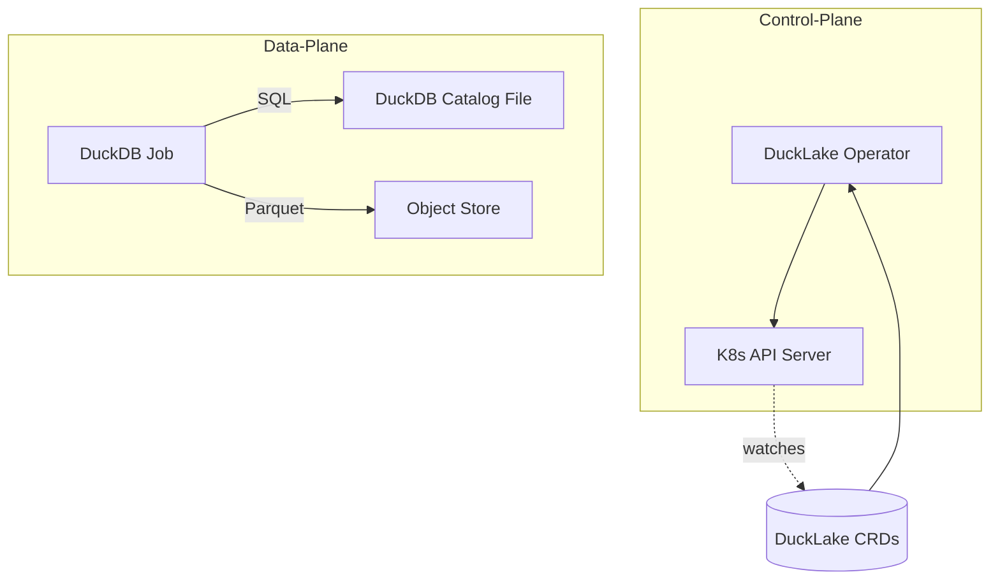
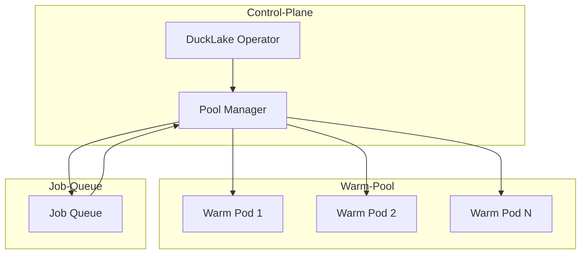

# Featherman Design

## 1. High-Level Architecture



Basic Flow:

1. User creates/updates a DuckLake Custom Resource
2. Operator reconciles by creating a DuckDB Job
3. Job executes SQL and manages Parquet files in object store
4. Status is updated with results

## 2. Custom Resources (MVP)

### DuckLakeCatalog

- Purpose: Defines the metadata storage configuration
- Spec:
  - `storageClass`: PVC storage class for catalog file
  - `objectStore`: S3-compatible store configuration
  - `size`: PVC size for catalog
  - `encryption`: Block encryption configuration (KMS key ID)
  - `backupPolicy`: Cron expression for backups
- Status:
  - `phase`: Current state (Pending/Running/Succeeded/Failed)
  - `lastBackup`: Timestamp of last successful backup

### DuckLakeTable

- Purpose: Declares table structure and location
- Spec:
  - `name`: Table name
  - `columns`: Column definitions
  - `format`: Parquet configuration
    - `compression`: ZSTD/SNAPPY
    - `partitioning`: List of partition columns
  - `location`: Object store path
  - `ttlDays`: Data retention period
  - `mode`: append/overwrite
- Status:
  - `phase`: Current state
  - `lastAppliedSnapshot`: Latest successful snapshot ID
  - `bytesWritten`: Total bytes written
  - `lastModified`: Last modification timestamp

## 3. Core Components

### 3.1 Operator

- Built with operator-sdk/Kubebuilder
- Single reconciler pattern
- Stateless design
- Handles CRD lifecycle
- Finalizers for clean resource deletion
- Validation webhooks for early error detection

### 3.2 Job Controller

- Creates ephemeral DuckDB pods
- Mounts catalog PVC
- Injects object store credentials
- Executes DDL/DML operations
- Features:
  - Init container with flock for DB file locking
  - Read-only PVC mounts for SELECT operations
  - Deterministic and idempotent SQL generation
  - Configurable via ConfigMap for pod templates
  - S3 consistency handling with HEAD checks

### 3.3 Storage

- Object Store: S3-compatible backend for Parquet files
- Catalog: DuckDB file on PVC for metadata
- Credentials managed via K8s secrets
- External secrets support (AWS Secrets Manager)

### 3.4 Observability

- Structured logging contract:
  - DEBUG: Full SQL scripts
  - INFO: Summarized operations (e.g., "Table X: +10 files, 23 MB")
- Grafana dashboard included in Helm chart
- Status metrics exposed for Prometheus

## 4. MVP Roadmap

### Phase 1: Foundation (2 weeks)

- [ ] Project setup with operator-sdk
- [ ] Basic CRD definitions with validation webhooks
- [ ] Simple reconciler loop
- [ ] DuckDB job template with init container
- [ ] Basic secret management

### Phase 2: Core Features (7 weeks)

- [ ] Table creation flow
- [ ] Parquet file management with consistency checks
- [ ] Read/Write job differentiation
- [ ] Error handling and retries
- [ ] Status updates and metrics
- [ ] Integration tests with mocked object store

### Phase 3: Stabilization (3 weeks)

- [ ] E2E testing on KinD
- [ ] Documentation
- [ ] Helm chart with Grafana dashboards
- [ ] Example manifests
- [ ] GitHub Actions CI/CD (K8s 1.29/1.30)
- [ ] kubectl plugin for table management

## 5. MVP Technical Decisions

1. **Catalog Storage**: Single DuckDB file on PVC
   - Simple, reliable for MVP
   - No concurrent write complexity
   - Init container with flock for safety
   - Read-only mounts for queries

2. **Job Model**: Ephemeral pods
   - Clean slate for each operation
   - Predictable resource usage
   - Idempotent operations
   - Configurable via ConfigMap

3. **Object Store**: S3-compatible only
   - Standardized interface
   - Wide compatibility
   - Consistency guarantees via HEAD checks
   - Atomic write operations

## 6. Future Considerations (Post-MVP)

- Warm pod pool for reduced latency
- Multi-writer support via Postgres catalog
- Interactive query gateway
- Snapshot/backup functionality
- Multi-tenancy
- Advanced monitoring
- Cost-based auto-vacuum/compact
- Policy-based schema drift detection

## 7. Warm Pod Pool Design

### 7.1 Overview

The warm pod pool eliminates cold start latency by maintaining pre-initialized DuckDB pods ready to execute queries immediately. This feature is critical for interactive workloads and low-latency query requirements.



### 7.2 Architecture Components

#### Pool Manager

- Maintains desired number of warm pods
- Monitors pod health and replaces unhealthy pods
- Assigns work to available pods
- Implements pod recycling policies
- Manages pool scaling based on demand

#### Warm Pod States

1. **IDLE**: Ready to accept work
2. **ACQUIRING**: Being assigned work
3. **BUSY**: Executing a query
4. **DRAINING**: Finishing current work before termination
5. **TERMINATING**: Being removed from pool

#### Pod Lifecycle

1. Pod starts and initializes DuckDB
2. Registers with pool manager as IDLE
3. Receives work assignment
4. Executes query
5. Returns to IDLE or gets recycled based on policy

### 7.3 Configuration

New CRD: `DuckLakePool`

```yaml
apiVersion: ducklake.featherman.dev/v1alpha1
kind: DuckLakePool
metadata:
  name: default-pool
spec:
  # Pool sizing
  minSize: 2
  maxSize: 10
  targetUtilization: 0.8
  
  # Pod template
  template:
    resources:
      requests:
        memory: "2Gi"
        cpu: "1"
      limits:
        memory: "4Gi"
        cpu: "2"
    
  # Lifecycle policies
  maxIdleTime: 300s          # Terminate pods idle > 5 min
  maxLifetime: 3600s         # Recycle pods after 1 hour
  maxQueries: 100            # Recycle after N queries
  
  # Scaling behavior
  scaleUpRate: 2             # Max pods to add per interval
  scaleDownRate: 1           # Max pods to remove per interval
  scaleInterval: 30s         # Evaluation interval
  
  # Catalog mounting
  catalogRef:
    name: main-catalog
    readOnly: true
    
  # Monitoring
  metrics:
    enabled: true
    port: 9090
```

### 7.4 Implementation Details

#### Pod Selection Algorithm

```
1. Filter pods by state == IDLE
2. Sort by: 
   - Least recently used
   - Lowest query count
   - Best resource fit
3. Select first matching pod
4. If none available, queue request
```

#### Auto-scaling Logic

```
desiredSize = ceil(activeQueries / targetUtilization)
desiredSize = max(minSize, min(maxSize, desiredSize))

if currentSize < desiredSize:
    scale_up(min(scaleUpRate, desiredSize - currentSize))
elif currentSize > desiredSize:
    scale_down(min(scaleDownRate, currentSize - desiredSize))
```

#### Health Checks

- **Liveness**: DuckDB process responsive
- **Readiness**: Can execute `SELECT 1`
- **Startup**: Catalog mounted and accessible

### 7.5 Integration Points

#### With DuckLakeTable Controller

```go
// Instead of creating a Job, request a warm pod
pod, err := poolManager.RequestPod(ctx, &PoolRequest{
    Catalog: table.Spec.CatalogRef,
    Resources: table.Spec.Resources,
    Timeout: 30 * time.Second,
})
if err != nil {
    // Fallback to Job creation
    return r.createJob(ctx, table)
}

// Execute query on warm pod
result, err := pod.ExecuteQuery(ctx, sqlScript)
```

#### Metrics Exposed

- `ducklake_pool_size_current`: Current number of pods
- `ducklake_pool_size_desired`: Target number of pods
- `ducklake_pool_pods_idle`: Number of idle pods
- `ducklake_pool_pods_busy`: Number of busy pods
- `ducklake_pool_queue_length`: Pending requests
- `ducklake_pool_query_duration`: Query execution time
- `ducklake_pool_wait_duration`: Time waiting for pod

### 7.6 Benefits

1. **Performance**: Eliminate cold start (typically 5-10s → <100ms)
2. **Resource Efficiency**: Reuse initialized pods
3. **Predictable Latency**: Consistent query response times
4. **Graceful Degradation**: Falls back to Jobs if pool unavailable
5. **Cost Optimization**: Scale based on actual demand

### 7.7 Security Considerations

1. **Pod Isolation**: Each pod runs with minimal privileges
2. **Catalog Access**: Read-only mounts by default
3. **Resource Limits**: Enforce CPU/memory limits
4. **Network Policy**: Restrict pod-to-pod communication
5. **RBAC**: Separate service account for pool pods
