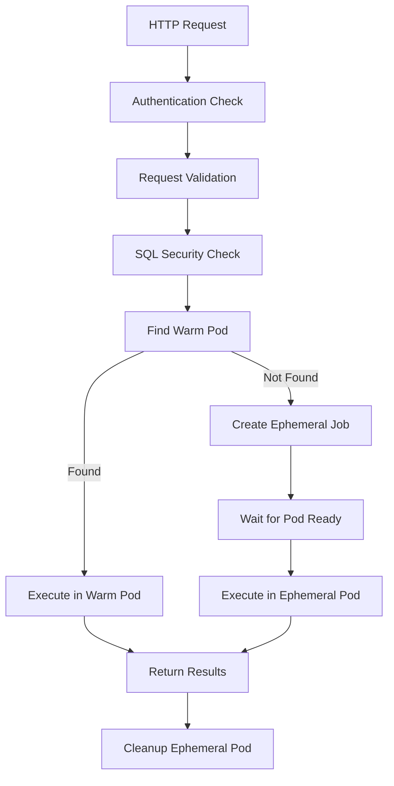

# Featherman Query Service

The Featherman Query Service is a high-performance, enterprise-grade HTTP service that executes SQL queries against DuckDB instances running in Kubernetes pods. It provides secure, scalable query execution with support for multiple output formats and intelligent pod management.

## Features

### Core Functionality
- **SQL Query Execution**: Execute SQL queries against DuckDB databases
- **Multiple Output Formats**: Support for CSV, JSON, Arrow, and Parquet formats
- **Intelligent Pod Management**: Automatically selects warm pods or creates ephemeral jobs
- **Security**: SQL injection protection with forbidden keyword filtering
- **Performance**: Efficient resource management and concurrent query support

### Enterprise Features
- **Authentication**: Bearer token authentication
- **Monitoring**: Request duration tracking and pod execution metrics
- **Error Handling**: Comprehensive error reporting with structured logging
- **Timeout Management**: Configurable query timeouts with context cancellation
- **Resource Limits**: Pod resource constraints for CPU and memory

## Architecture

### Components

1. **HTTP Router** (`router.go`)
   - RESTful API endpoints
   - Request validation and authentication
   - Response header management with custom tracking headers

2. **Query Executor** (`executor.go`)
   - SQL validation and security filtering
   - Kubernetes pod selection and management
   - Query execution via pod exec
   - Ephemeral job creation and cleanup

3. **Client Interface** (`client.go`)
   - Placeholder for future client utilities
   - Kubernetes client abstractions

### Query Execution Flow



## API Endpoints

### POST /query

Execute a SQL query against a DuckDB database.

**Request:**
```json
{
  "sql": "SELECT * FROM my_table LIMIT 10",
  "catalog": "my-catalog",
  "format": "csv"
}
```

**Headers:**
- `Authorization: Bearer <token>` (required)
- `Content-Type: application/json`

**Response Headers:**
- `X-Featherman-Catalog`: The catalog used for the query
- `X-Featherman-Pod`: The pod name that executed the query
- `X-Featherman-Duration`: Query execution duration
- `Content-Type`: Set based on requested format

**Supported Formats:**
- `csv` (default): Returns CSV data with `text/csv` content type
- `json`: Returns JSON data with `application/json` content type
- `arrow`: Returns Arrow stream with `application/vnd.apache.arrow.stream` content type
- `parquet`: Returns Parquet data with `application/octet-stream` content type

**Example:**
```bash
curl -X POST http://localhost:8080/query \
  -H "Authorization: Bearer your-token" \
  -H "Content-Type: application/json" \
  -d '{
    "sql": "SELECT COUNT(*) FROM users",
    "catalog": "analytics",
    "format": "json"
  }'
```

### GET /healthz

Health check endpoint.

**Response:**
```
ok
```

## Security

### SQL Validation

The service implements comprehensive SQL validation to prevent security vulnerabilities:

**Forbidden Keywords:**
- `ATTACH` - Prevents database attachment
- `INSTALL` - Prevents extension installation
- `COPY` - Prevents file operations
- `EXPORT` - Prevents data export
- `PRAGMA` - Prevents configuration changes

**Validation Rules:**
- Empty queries are rejected
- Case-insensitive keyword detection
- Word boundary detection to avoid false positives in string literals

### Authentication

All query requests must include a valid Bearer token in the Authorization header:
```
Authorization: Bearer <your-token>
```

## Configuration

### Environment Variables

- `PORT`: HTTP server port (default: 8080)

### Kubernetes Configuration

The service requires appropriate RBAC permissions:

```yaml
apiVersion: rbac.authorization.k8s.io/v1
kind: ClusterRole
metadata:
  name: featherman-query
rules:
- apiGroups: [""]
  resources: ["pods"]
  verbs: ["get", "list", "create", "delete", "watch"]
- apiGroups: [""]
  resources: ["pods/exec"]
  verbs: ["create"]
```

## Pod Management

### Warm Pods

The service first attempts to find existing "warm" pods that can handle queries:

**Selection Criteria:**
- Label: `ducklake.featherman.dev/catalog=<catalog-name>`
- Label: `warm-pod=true`
- Status: `Running`

### Ephemeral Jobs

When no warm pods are available, the service creates ephemeral job pods:

**Pod Specification:**
- Image: `datacatering/duckdb:v1.3.0`
- Restart Policy: `Never`
- Resource Limits: 1 CPU, 1Gi memory
- Resource Requests: 100m CPU, 256Mi memory
- Labels: Catalog and query type identification

**Cleanup:**
- Automatic deletion after query completion
- Grace period: 0 seconds for immediate cleanup
- Background cleanup to avoid blocking responses

## Performance

### Timeout Management

- **Default Query Timeout**: 5 minutes
- **Context Cancellation**: Proper cleanup on client disconnection
- **Pod Creation Timeout**: Inherited from query context
- **Cleanup Timeout**: 30 seconds maximum

### Concurrent Queries

The service supports concurrent query execution:
- Thread-safe request handling
- Independent pod management per query
- Efficient resource utilization

## Monitoring and Observability

### Response Headers

Every query response includes tracking headers:
- `X-Featherman-Catalog`: Identifies the data catalog
- `X-Featherman-Pod`: Pod that executed the query
- `X-Featherman-Duration`: Execution time measurement

### Logging

Structured logging with zerolog:
- Error logging for query failures
- Info logging for service startup
- Request/response correlation

## Development

### Building

```bash
go build ./cmd
```

### Testing

```bash
# Run all tests
go test ./...

# Run with verbose output
go test -v ./internal/query

# Run specific test
go test -v -run TestValidateSQL ./internal/query
```

### Test Coverage

The implementation includes comprehensive test coverage:

- **Unit Tests**: SQL validation, pod selection, executor logic
- **Integration Tests**: End-to-end HTTP request handling
- **Mock Testing**: Fake executors for isolated testing
- **Concurrent Testing**: Multi-threaded query execution
- **Error Testing**: Timeout, authentication, and validation failures

## Deployment

### Docker

```dockerfile
FROM golang:1.21-alpine AS builder
WORKDIR /app
COPY . .
RUN go build -o featherman-query ./cmd

FROM alpine:latest
RUN apk --no-cache add ca-certificates
WORKDIR /root/
COPY --from=builder /app/featherman-query .
CMD ["./featherman-query"]
```

### Kubernetes

```yaml
apiVersion: apps/v1
kind: Deployment
metadata:
  name: featherman-query
spec:
  replicas: 3
  selector:
    matchLabels:
      app: featherman-query
  template:
    metadata:
      labels:
        app: featherman-query
    spec:
      serviceAccountName: featherman-query
      containers:
      - name: featherman-query
        image: featherman/query:latest
        ports:
        - containerPort: 8080
        env:
        - name: PORT
          value: "8080"
        resources:
          requests:
            cpu: 100m
            memory: 128Mi
          limits:
            cpu: 500m
            memory: 512Mi
---
apiVersion: v1
kind: Service
metadata:
  name: featherman-query
spec:
  selector:
    app: featherman-query
  ports:
  - port: 80
    targetPort: 8080
  type: ClusterIP
```

## License

This project is licensed under the MIT License - see the LICENSE file for details.
